技术栈
- 日志：logback
- 测试报告：extentreports
- 脚本结构定义：XSD
- 脚本：XML + Java
- xml 解析：dom4j
- PagePojo 生成：freemarker
- case 管理以及执行：TestNG
- 自动化：Selenium
- 实例管理：Spring

# 常用功能

## XML描述

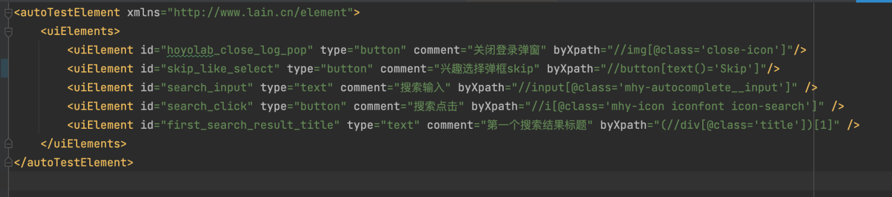
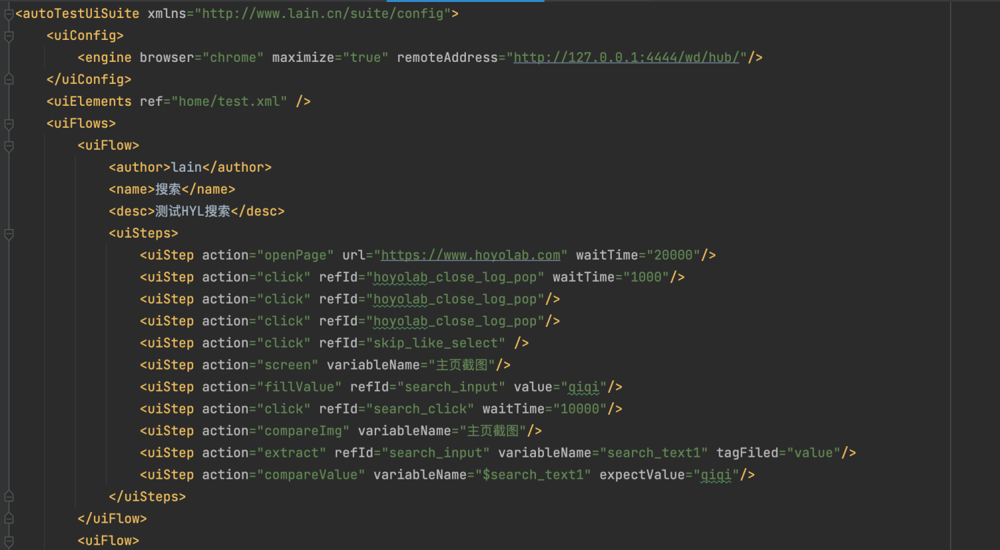
使用具备自描述性的 XML 进行脚本编写，降低门槛
如果想要新增标签/属性，在 XSD 中定义和对应的 entity 增加字段后，在AutoTestSuiteParser类中增加赋值即可

## 元素复用
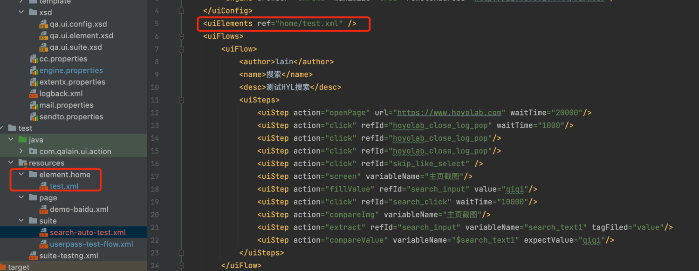
即可使用，重复引用可实现复用

## 提取与比较
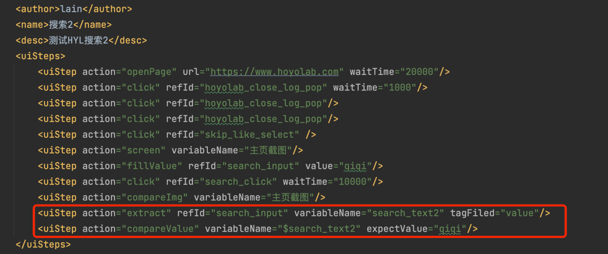
通过指定 html 标签的属性获取对应值，和 variableName 以 kv 的形式存储在 threadLocal 的 Map 中，从而在同一 testFlow 的后续流程中以 $variableName 进行提取，与期望值比较

## 模板匹配点击

使用 JavaCV 进行模板匹配并点击的操作
eg：
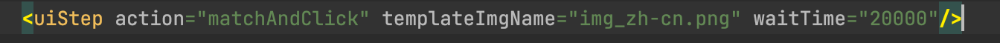
使用属性 templateImgName 即可
模板图片存放于 src/test/template_img 下，源图片则是当前浏览器窗口截图
tips：使用模板匹配时，不建议在本地执行，会大概率失败，因为本地操作可能会干扰鼠标原始定位

## 并发与分布式执行

通过反射读取 engine.properties 文件中的配置，可动态配置并发执行用例数
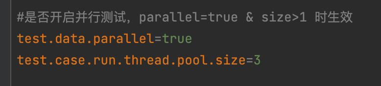
并发执行时将会 send task 到 selenium-hub，并进行分发，加快执行速度

## 执行自定义方法

使用 custom 标签时，指定 customFunction 指定类的的 bean 名称，并且该类应该实现 ICustomAction 的 execute 方法
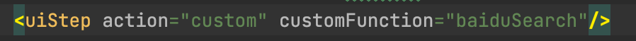
方法 bean 名称为@Service()中的 beanName
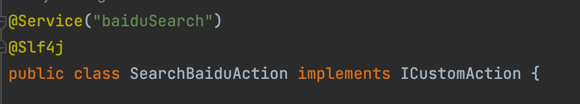

## 常用操作封装
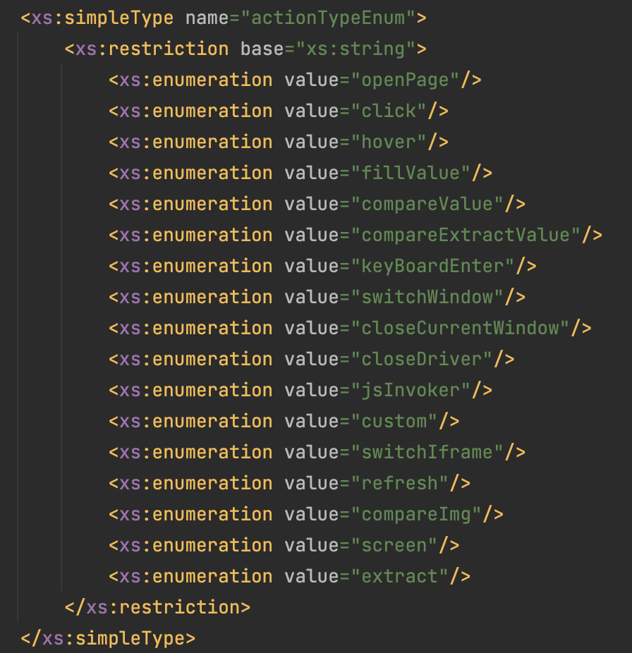
封装了常用的操作，同时可以进行扩展

# 环境部署


## selenium-grid

### mac m1 (arm64)
```yaml
version: "3"
services:
  selenium-hub:
    image: seleniarm/hub:4.0.0-beta-1-20210215
    container_name: selenium-hub-arm
    ports:
      - "4444:4444"
    environment:
      - GRID_MAX_SESSION=50
      - GRID_TIMEOUT=200
      - START_XVFB=false
      - GRID_CLEAN_UP_CYCLE=200
  chrome:
    image: seleniarm/node-chromium:4.0.0-beta-1-20210215
    volumes:
      - /dev/shm:/dev/shm
    depends_on:
      - selenium-hub
    environment:
      - SE_EVENT_BUS_PUBLISH_PORT=4444
      - SE_EVENT_BUS_HOST=selenium-hub
      - SE_EVENT_BUS_SUBSCRIBE_PORT=4443
      - NODE_MAX_INSTANCES=5
      - NODE_MAX_SESSION=5
      - GRID_CLEAN_UP_CYCLE=200
```

## Extentx
创建 Dockerfile 文件
```shell
FROM node:alpine
LABEL maintainer="lain"

RUN mkdir -p ./app
WORKDIR ./app

RUN apk add --no-cache git
RUN git clone https://gist.github.com/3c4f35a41c58a55a0ffd00c3e64142c8.git tmpChange
RUN git clone https://github.com/anshooarora/extentx.git

RUN mv tmpChange/connections.js extentx/config/connections.js
RUN rm -rf tmpChange

WORKDIR ./extentx

EXPOSE 1337

RUN npm set registry https://registry.npm.taobao.org
RUN npm config set registry https://registry.npm.taobao.org
RUN npm config set disturl https://npm.taobao.org/dist
RUN npm install

CMD ["./node_modules/.bin/sails", "lift"]
```

执行 `docker build -t extentx .`

创建 docker-compose.yml
```yaml
version: '3.6'
services:
 extentx:
  build: .
  environment:
    - MONGODB_PORT_27017_TCP_ADDR=mongo
  links:
    - mongo:mongo
  ports:
    - 1337:1337

 mongo:
  image: mongo:3.4
  ports:
    - 27010:27017
```

`docker-compose up -d` 启动
访问 localhost:1337 即可

## 打包到本地仓库
下载附在项目下 pj_resource 中的 extentsReport-1.0-SNAPSHOT.jar ，提取出 jar 包中的 pom 文件，和 jar 放在同一级目录下，执行命令
`mvn install:install-file -Dfile=extentsReport-1.0-SNAPSHOT.jar 
-DartifactId=extentsReport -DgroupId=com.antigenmhc -Dversion=1.0-SNAPSHOT -Dpackaging=jar -DpomFile=pom.xml`
即可


## JavaCV
前置环境为已下载 arm64 版本的 JDK
1. 安装并设置环境变量
```shell
# 升级 brew
brew update
# 安装 cmake
brew install cmake
# 安装 ant
brew install ant

export JAVA_HOME=/Library/Java/JavaVirtualMachines/jdk1.8.0_331.jdk/Contents/Home
export PATH=$JAVA_HOME/bin:$PATH
export JAVA_AWT_INCLUDE_PATH=$JAVA_HOME
export JAVA_AWT_LIBRARY=$JAVA_HOME
export JAVA_INCLUDE_PATH=$JAVA_HOME/indclude
export JAVA_INCLUDE_PATH2=$JAVA_HOME/include/darwin
export JAVA_JVM_LIBRARY=$JAVA_HOME
```

2. 打开 java build
`brew edit opencv`
找到
`-DBUILD_opencv_java=OFF` 修改为 `-DBUILD_opencv_java=ON`
在上面的参数之后添加参数：`-DOPENCV_JAVA_TARGET_VERSION=1.8`，防止使用高版本 JDK 进行编译

3. 编译
`brew install --build-from-source opencv`

4. 生成 jar 和dylib：成功后在 /opt/homebrew/Cellar/opencv/4.7.0/share/java/opencv4 
目录下会生成 libopencv_java470.dylib 和 opencv-470.jar
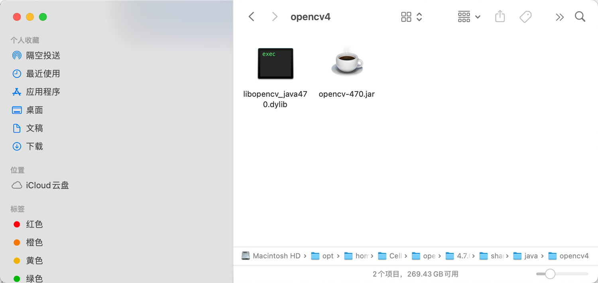

5.将 jar 和 dylib 加入项目
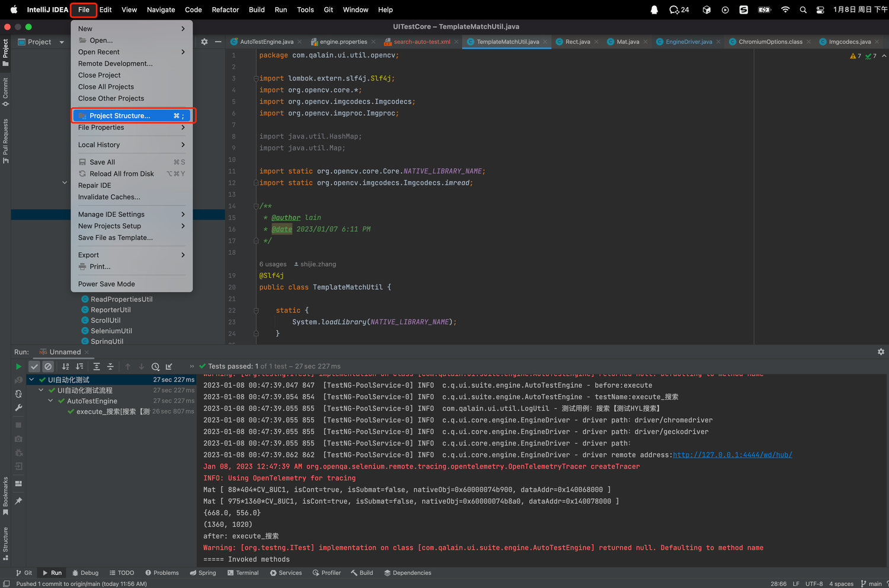
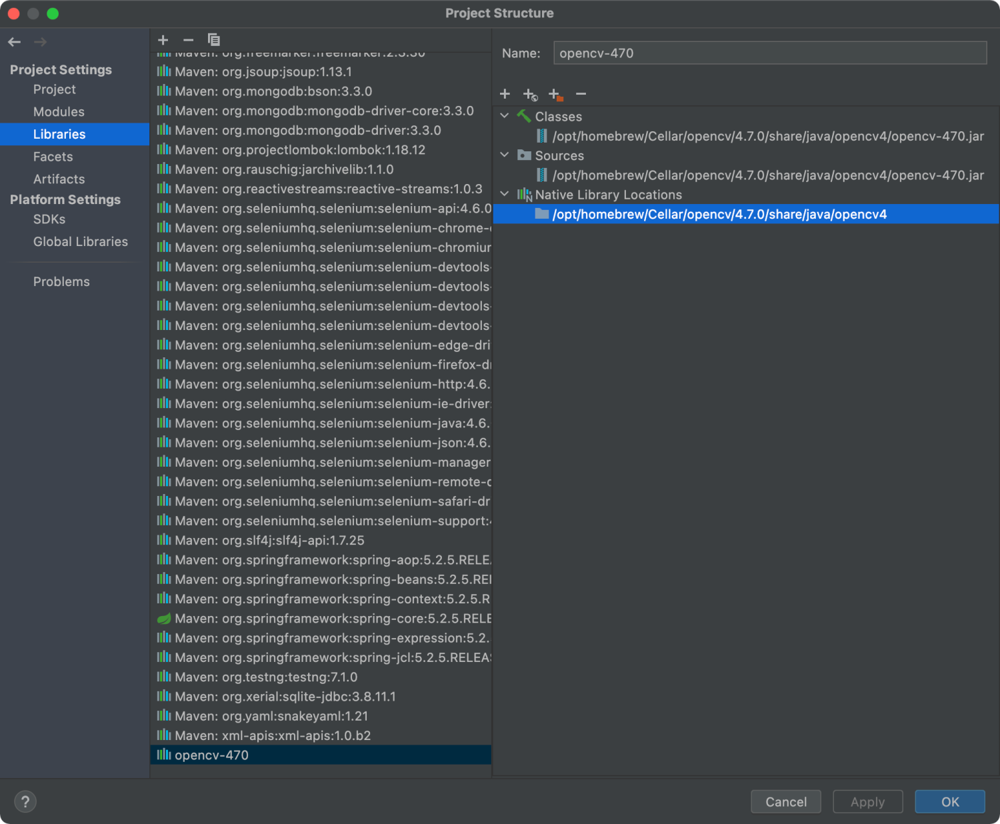
设置项目 JDK 为刚才用来编译 (即 JAVA_HOME ) 的 JDK

6. 引入依赖
```xml
<dependency>
  <groupId>org.bytedeco</groupId>
  <artifactId>javacv-platform</artifactId>
  <version>1.5.7</version>
</dependency>
<dependency>
  <groupId>org.bytedeco</groupId>
  <artifactId>javacpp</artifactId>
  <version>1.5.7</version>
</dependency>
```

7. 运行 demo
```java
//待匹配图片
Mat src = imread("filePath",Imgcodecs.IMREAD_GRAYSCALE);
Mat mInput=src.clone();
// 获取匹配模板
Mat mTemplate = imread("filePath",Imgcodecs.IMREAD_GRAYSCALE);
/**
* TM_SQDIFF = 0, 平方差匹配法，最好的匹配为0，值越大匹配越差
* TM_SQDIFF_NORMED = 1,归一化平方差匹配法
* TM_CCORR = 2,相关匹配法，采用乘法操作，数值越大表明匹配越好
* TM_CCORR_NORMED = 3,归一化相关匹配法
* TM_CCOEFF = 4,相关系数匹配法，最好的匹配为1，-1表示最差的匹配
* TM_CCOEFF_NORMED = 5;归一化相关系数匹配法
*/
int resultRows = mInput.rows() - mTemplate.rows() + 1;
int resultCols = mInput.cols() - mTemplate.cols() + 1;
Mat gResult = new Mat(resultRows, resultCols, CvType.CV_32FC1);

Imgproc.matchTemplate(mInput, mTemplate, gResult, Imgproc.TM_CCORR_NORMED);

Core.normalize(gResult, gResult, 0, 1, Core.NORM_MINMAX, -1, new Mat());
Core.MinMaxLocResult mmlr = Core.minMaxLoc(gResult);
Point matchLocation = mmlr.maxLoc;

double x = matchLocation.x + (mTemplate.cols() / 2);
double y = matchLocation.y + (mTemplate.rows() / 2);
System.out.println(new Point(x, y));
```

# 项目运行
1. 拉取项目：https://github.com/iwakura-lain/UITestCore.git
2. 在idea中打开项目
3. 默认拉下来的项目使用的是 remote 模式执行测试，如需改为本地进行，则需要将下图中 engine 的属性给去掉
4. 运行 testng 的 xml 文件/mvn test
5. 如果是 remote 模式，则可以在 selenium-grid 的 session 页面查看执行；如果是本地执行，则会启动本地浏览器 (驱动和浏览器版本需要对应)